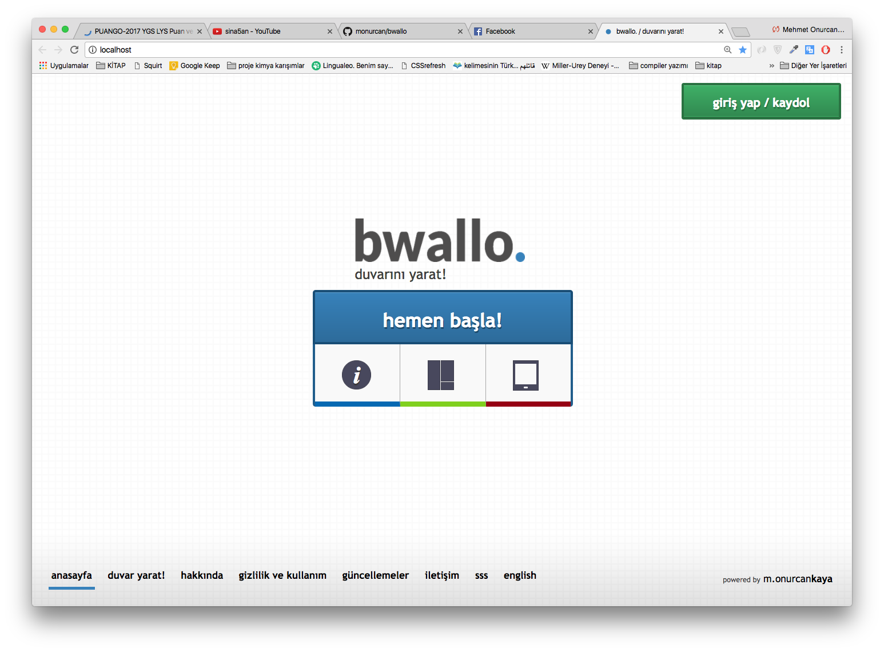

bwallo.
=====

duvar tabanlı sosyal ağ.

https://www.youtube.com/watch?v=SgJayZVxk3g&t=156s

.htaccess yükleyemedim Github'a:

Options +FollowSymLinks  
RewriteEngine On  
RewriteCond %{SCRIPT_FILENAME} !-d  
RewriteCond %{SCRIPT_FILENAME} !-f  
RewriteRule ^([a-zA-Z0-9_-]+)$ index.php?do=$1
RewriteRule ^([a-zA-Z0-9_-]+)/$ index.php?do=$1
RewriteRule ^users/([^/]+)$ index.php?do=profile&user_name=$1
RewriteRule ^users/([^/]+)/$ index.php?do=profile&user_name=$1
RewriteRule ^wall/([^.]+)/post/([0-9_-]+)$ index.php?do=wall&wall_domain=$1&article_id=$2
RewriteRule ^wall/([^.]+)/post/([0-9_-]+)/$ index.php?do=wall&wall_domain=$1&article_id=$2 
RewriteRule ^wall/([^.]+)/$ index.php?do=wall&wall_domain=$1
RewriteRule ^wall/([^.]+)$ index.php?do=wall&wall_domain=$1
RewriteRule ^delete-wall/([^.]+)$ index.php?do=delete-wall&wall_domain=$1
RewriteRule ^delete-wall/([^.]+)/$ index.php?do=delete-wall&wall_domain=$1
RewriteRule ^page/([^.]+)$ index.php?do=page&page_name=$1
RewriteRule ^page/([^.]+)/$ index.php?do=page&page_name=$1
RewriteRule ^search/([^.]+)$ index.php?do=search&src=$1
RewriteRule ^search/([^.]+)/$ index.php?do=search&src=$1
ErrorDocument 404 ""

**Kurulum**
0. Yukarıdaki .htaccess'i bir metin düzenleyicisine atıp ardından .htaccess adıyla proje ana dizinine kaydedin.
1. MySQL'de bir database oluşturup "bwallo.sql"i import edin.
1.1. [Opsiyonel] Şimdi ise general_settings table'ındaki site_url'i kendinize göre ayarlamanız gerekiyor. Direkt localhost olarak kalabilir. IP üzerinden yayın yapacaksanız SQL update ile güncelleyebilirsiniz.
1.2. [Opsiyonel] Yine aynı şekilde site başlığını, açıklamasını, keywordslerini vs. general_settings'ten değiştirebilirsiniz. Bunun için şu tarz bir SQL komutu yeterli olacaktır:
UPDATE `general_settings` SET `site_title`="[İSTEDİĞİNİZ SİTE BAŞLIĞI]"
2. Ardından /includes altındaki config.php'den gerekli bağlantı ayarlamalarını yapın. $host_name değişkenini mySQL hostunuzun adresine, $mysql_user değişkenini mySQL kullanıcı adına, $mysql_pass değişkenini mySQL şifresine ve *$db_name değişkenini birinci adımda oluşturduğunuz database'in adına eşitleyin*.
3. İkinci adımındaki config ayarlarının aynısını ana dizindeki server.js dosyası için de yapın. Bu dosyada da 6. satırdaki createConnection fonksiyonunun değişkenlerini ikinci adımdaki gibi değiştirin.
4. Terminalde *cd* komutu ile proje ana dizinine gelin [örneğin Mac için cd /Applications/MAMP/htdocs/ ve ardından "node server.js" komutuyla server.js'i çalıştırın. [Node.js bilgisayarınızda yüklü olmalı tabii. Bkz.: https://nodejs.org/en/download/]
5. Kurulumuz tamamlanmıştır.
